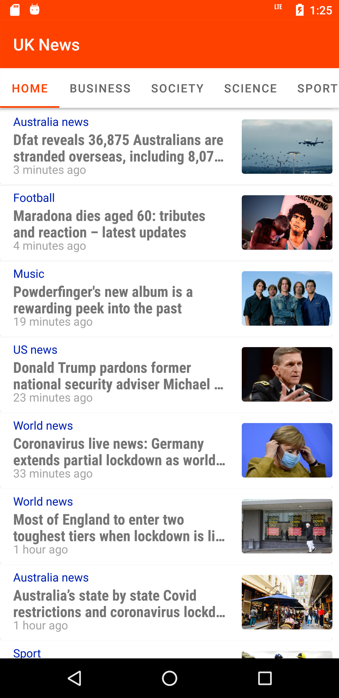

# News App
Developed for personal application production study.

### Project Overview

The goal is to create a UK News app which gives a user regularly-updated news from the internet 
related to a particular topic, person, or location. 
In this project, use [Guardian API](http://open-platform.theguardian.com/documentation/). 
This is a well-maintained API which returns information in a JSON format.

### API Key Note
You need to insert your API key.

### Features
* MVVM
* Fragments
* ViewPager plus TabLayout
* Intent
* Retrofit
* Guardian API
* JSON Parsing
* Glide
* WebView
* CardView
* RecyclerView

### Screenshots

### Image resources
 

# UK News 

I would like to share with you my first app published on the Google Play Store.

I’m happy that I was able to build something useful, and I want to thank you for your support.
Please note that this app is not an open source app. If you have any issues, please feel free to contact me. Your comments and suggestions are important to me. I love your feedback. 
jseun112@gmail.com

If you like my app, you can download it on Google Play.
[UK News](https://play.google.com/store/apps/details?id=com.dotori.news)
